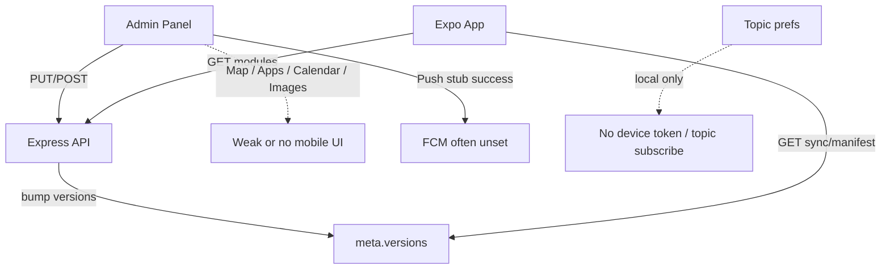

# IITJ1 — Product & Engineering Suggestions

**Generated:** 14 Jul 2026  
**Scope:** `apps/api`, `apps/mobile`, `apps/admin`, monorepo scripts/docs  
**Method:** Codebase audit against FinalDoc launch plan + current implementation  

This document is **advisory** — it does not change locked v1 scope unless you explicitly pull items into the roadmap. Prioritize **P0 → P1 → P2**.

---

## Executive summary

IITJ1 has a working **Express API**, **Expo mobile app**, and **Next.js admin** with campus sync, local personal tools (Mess QR / Timetable / Notes), and admin editors for most modules.

The biggest gaps are not “missing screens” alone — they are **broken loops**: admin writes that mobile never shows, push that reports success without delivery, sync that does not refresh sibling screens, and production/Docker hardening still incomplete.

---

## P0 — Critical (fix before real users / store)

### API & security

| ID | Issue | Why it matters | Suggested fix |
|----|--------|----------------|---------------|
| A1 | Docker boot depends on `docs/FinalDoc` seed paths not copied into the image | Container can crash even with Mongo up | Embed seed JSON in `dist`, COPY docs into image, or lazy-load seed only in fallback |
| A2 | Default `JWT_SECRET` and bootstrap password can ship if env forgotten | Admin token forgery / takeover | Fail start when `NODE_ENV=production` and secrets are defaults |
| A3 | Fallback mode: empty admins, ephemeral writes; health still `ok` | Ops false confidence | Health should report storage mode; refuse admin writes without Mongo in prod |
| A4 | Invalid notice `:id` → `ObjectId` throws | Possible 500 / unhandled rejection | Validate ObjectId; return 400 |
| A5 | Global open CORS then admin CORS | Admin origin lockoverridden | Apply open CORS only to public router; keep locked CORS on `/admin` |
| A6 | FCM stub returns `{ success: true }` when unset | Admins think pushes delivered | Return **503** when Firebase not configured; never bump versions on stub |

### Mobile / product loops

| ID | Issue | Why it matters | Suggested fix |
|----|--------|----------------|---------------|
| M1 | Push prefs are local-only; no Expo push token / FCM topic subscribe | Settings toggles do nothing; Push admin is theater | Register token; subscribe/unsubscribe topics; wire deep links |
| M2 | Synced `map` unused — map UI uses hardcoded campus directory | Admin Map edits never reach students | Prefer API cache; merge/fallback to bundled seeds |
| M3 | Synced `apps` module never rendered | Admin Apps is a dead end | Add Apps screen under More |
| M4 | Calendar synced only for holiday transport — no student calendar UI | Spec includes Academic Calendar | Add Calendar screen + Home upcoming strip |
| M5 | Sync does not refresh sibling tabs | Home syncs; Menu/Notices can stay empty/stale | Shared campus store (Context/Zustand) + version listeners |
| M6 | Map “share/copy” uses invalid URL | Broken UX | Use Clipboard / Share API |

### Admin authenticity of data ops

| ID | Issue | Why it matters | Suggested fix |
|----|--------|----------------|---------------|
| AD1 | Public `GET /notices` filters active-only | Admins cannot edit scheduled/expired | `GET /admin/notices` (all statuses) |
| AD2 | Transport & Calendar are raw JSON editors | Easy to break mobile Zod schemas | Structured trip/event tables + client Zod mirroring API |

---

## P1 — High priority (next sprint after P0)

### Reliability & deploy

1. **`trust proxy`** for Render so rate limits use real client IPs.  
2. **Keep-alive GitHub Action** hitting `/api/v1/health` (launch plan sample path is wrong).  
3. **Unique indexes** on module docs by `campusId` (menus, transport, etc.).  
4. **Unify notice writes** so fallback paths always invalidate `meta` via `bumpVersion`.  
5. **Refresh-token revocation / admin existence check** on refresh.  
6. Docker: fix HEALTHCHECK tool (`wget` may be missing on alpine); don’t expose Mongo `27017` publicly in compose.

### Mobile UX & fidelity

7. **Surface sync errors** (today mostly EmptyState + pull-to-refresh).  
8. **Notice `imageUrl`** rendering on cards; open `link` reliably.  
9. **Category mute** should filter notices feed (or clearly label as “push-only — coming soon”).  
10. **IBM Plex** via `expo-font` (Stitch / Designplan).  
11. Accessibility pass: labels on tiles, switches, QR full-screen.  
12. **Bundle emergency contacts offline fallback** (launch plan); empty cache ≠ empty life safety.  
13. Deduplicate transport logic (`utils/transport.ts` vs `ScheduleEngine.ts`).  
14. Fix map share; dark-mode inconsistency on MapLibre WebView (fixed light basemap).

### Admin UX

15. **Cloudinary upload widget** using `POST /admin/uploads/sign` (URL paste is insufficient).  
16. Structured **Transport** editor (weekday × direction × trips).  
17. Structured **Calendar** editor with `type: holiday` called out in UI.  
18. Suggestions **triage** (read / archived) — still no student PII.  
19. Responsive admin shell (sidebar collapses on narrow viewports).  
20. Show Zod API validation errors in toasts with field paths.

### Monorepo hygiene

21. Single LAN script source of truth (`set-lan-ip.js` vs `.sh` can diverge).  
22. Root README: one architecture tree including **admin**; remove duplication; fix Windows-only bias.  
23. Optional npm workspaces + shared `@iitj1/types` for Zod/schemas.  
24. Replace placeholder EAS `projectId` in `app.json`.

---

## P2 — Nice-to-have / v1.x+.5 enhancements

### Product features (still within campus companion spirit)

| Feature | Notes | Risk vs scope lock |
|---------|--------|--------------------|
| Academic Calendar screen | Events list + filters | In launch scope — should ship |
| Campus Apps directory | Store links + icons | In launch scope — should ship |
| Wire Laundry / Wi‑Fi / E‑rickshaw to admin modules | Today hardcoded in mobile | New API modules = scope expand — plan as v1.2 |
| Meal window configuration in admin | Windows hardcoded in `date.ts` | Nice; not required for v1 |
| Push deep links | Notice / menu / bus | After FCM works |
| Cabs & Autos beyond “Coming soon” | Explicitly out of v1 for marketplace | Keep out until v2 |

### Engineering polish

- Soft-delete notices with restore from audit.  
- Pagination for notices, suggestions, audit.  
- Request IDs + structured logging (`LOG_LEVEL` is unused).  
- Graceful `SIGTERM` / DB disconnect.  
- Separate JWT secrets for access vs refresh.  
- API `lint` / `test` scripts; unit tests for CSV parser + version bump.  
- Menu CSV import → real calendar month dates (today Mon–Sun → `${month}-01..07`).  
- Admin RBAC (`role` on JWT unused).  
- Shared React Query–style caching or SWR for admin reads.

### Design / Stitch

- Notice thumbnails matching Stitch.  
- Stronger first-viewport loading (splash) instead of blank `null` while cache hydrates.  
- Reduce-motion already partially respected on DepartureBoard — extend to dashboard motion.

---

## Cross-app consistency matrix

| Module | Admin can edit? | Mobile shows? | Gap |
|--------|-----------------|---------------|-----|
| Menu | Yes (form + CSV) | Yes | Meal clock windows not admin-configurable |
| Notices | CRUD | Text only | No images; mute unused; admin can’t see expired |
| Transport | JSON | Yes | Editor fragility |
| Calendar | JSON | Holiday logic only | No student UI |
| Portals | Yes | Yes | OK |
| Services | Yes | Yes | OK |
| Emergency | Yes | Yes | Needs offline bundle |
| About | Yes | Yes | OK |
| Map | Yes | Hardcoded directory | **Break** |
| Apps | Yes | No screen | **Break** |
| Push | Composer | Local toggles | **Break** |
| Laundry / Wi‑Fi / E‑rickshaw | No | Local hardcoded | Admin cannot operate |

---

## Recommended 3-sprint roadmap

### Sprint A — Close the loops (P0)
1. Production secret + Docker seed fixes.  
2. FCM real path or honest failure; stop notices version bump on push.  
3. Reactive campus sync store.  
4. Map consume API + Apps screen + Calendar screen (minimum).  
5. `GET /admin/notices` + ObjectId guard.  
6. CORS layering + FCM 503.

### Sprint B — Admin & content ops (P1)
1. Structured Transport + Calendar editors.  
2. Cloudinary notice upload + mobile image render.  
3. Sync error UI + emergency offline fallback.  
4. Fonts + accessibility baseline.  
5. Keep-alive workflow + `trust proxy`.

### Sprint C — Platform & growth (P2)
1. Shared types package + tests.  
2. Laundry/Wi‑Fi/e‑rickshaw admin-backed content.  
3. Suggestions triage, audit filters.  
4. README / monorepo cleanup.  
5. Store submission hardening (EAS, privacy copy, load test).

---

## What is already strong (keep)

- Version-gated sync model (`/sync/manifest`) is the right architecture for free-tier scale.  
- Local-only Mess QR / Timetable / Notes separation matches launch principles.  
- Admin Mess Menu day×meal editor + CSV import is production-minded.  
- Design tokens / dual theme baseline on mobile and admin branding are coherent.  
- Admin same-origin `/backend` proxy avoids local CORS/CORP pain during development.

---

## Out of scope reminder (do not sneak into v1)

From FinalDoc lock: student accounts, marketplace, chat, AI assistant, clubs/events social module, ride-sharing as a marketplace.

Placeholders like Cabs & Autos “Coming soon” are fine; building those platforms is **v2**.

---

## Appendix — Key file references

| Area | Paths |
|------|--------|
| API entry / helmet | `apps/api/src/index.ts` |
| Config / secrets | `apps/api/src/config.ts` |
| FCM stub | `apps/api/src/services/fcm.ts` |
| Version bump / notices | `apps/api/src/store/index.ts` |
| Menu CSV | `apps/api/src/services/parsers.ts` |
| Mobile sync | `apps/mobile/src/services/sync.ts`, `hooks/useCampusSync.ts` |
| Map (hardcoded) | `apps/mobile/src/campus/data/locations.ts` |
| Admin JSON editors | `apps/admin/components/JsonModuleEditor.tsx` |
| Admin proxy | `apps/admin/next.config.mjs` |
| LAN scripts | `scripts/set-lan-ip.js`, `scripts/set-lan-ip.sh` |
| Spec | `docs/FinalDoc/laubchplan_Final.md`, `BUILD_PROMPT_RN_Express.md` |

---

## How to use this doc

1. Product owner picks **Sprint A** items that are in-scope.  
2. Track implementation as GitHub issues tagged `p0` / `p1` / `p2`.  
3. Re-run this audit after Sprint A — especially the **consistency matrix**.  

*Document location: [`docs/suggestions/IITJ1_ANALYSIS_AND_SUGGESTIONS.md`](./IITJ1_ANALYSIS_AND_SUGGESTIONS.md)*
